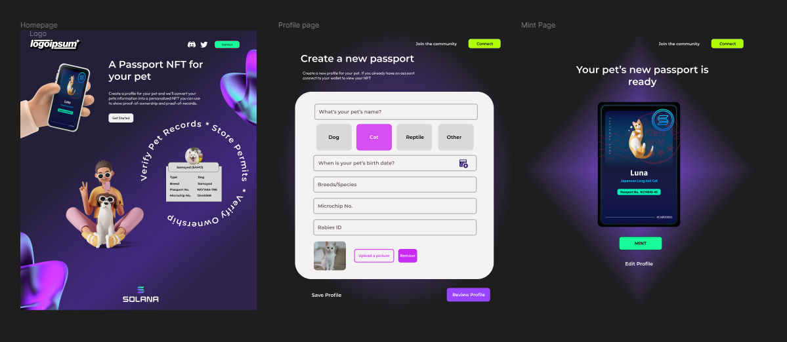

# Solana Hackathon 2023 -- SolPets 

This is the official Solana Hackathon 2023 submission for our project SolPets 🌈. 

## Project Description 
SolPets is a pet verification platform that turns your pet's information into a passport NFT to show proof-of-animal, and proof-of-ownership. SolPets aims to make record keeping easier for pet parents so that they can store important vaccination records and health information in one place and keep pet's history accessible at all times. Our goal for this project is to also help stop the illegal trafficking of endangered animals and help support animal shelters by making exclusive NFTs that can be auctioned to donate to various animal organizations. We will also generate and store NFTs for pets that are looking for homes so that families looking to adopt or support the pet in need can do so. 


## Features 
- Make pet records accessible only to people you trust
- Store your pets records in one place 
- Trade or sell NFTs to earn tokens


Deployed contracts : 

- [PolygonMumbai](https://mumbai.polygonscan.com/) 
- [CronosTestnet](https://cronos.org/docs/getting-started/cronos-testnet.html) 
- [GnosisTesnet (sokol)](https://blockscout.com/xdai/testnet) 
- [CeloTesnet (Alfajores)](https://alfajores-blockscout.celo-testnet.org/) 
- [NeonTestnet](https://neon-labs.org/)

Those deployments were done using .......

## UI Wireframes 

We were inspired to make a website that would be easy to navigate and accessible to anyone. We also wanted the site to resonate with the Solana community and kept it on-brand and consistent with solana branded colors.


 


## How it Works

1. Connect to your wallet 
2. Fill out a form with your pets information
3. Review your pet's passport to make sure everything is accurate
4. Mint


## What's next for SolPets ?  

We are planning to add many features such as : 
- marketplace for auctioned NFTs 
- multisign signing and verification
- A stats page to show pet's health over time (Aging updates, checkup reminders)
- Create a community and feature pets in our platform
- Create a token pet parents can earn and redeem for free stuff
- Collaborate with certified organizations to secure the protection of animals and wildlife


## Getting Started

```bash
# Install pnpm
npm i -g pnpm

# Install dependencies
pnpm install

# Copy & fill environments
cp packages/frontend/.env.local.example packages/frontend/.env.local
cp packages/hardhat/.env.example packages/hardhat/.env
```


## Development

```bash
# Generate contract-types & start frontend with turborepo
pnpm dev
```


## Proof of Animal : 

You can take a look at our proposal : 


## Twitter :  [SolPets](https://twitter.com/) 

- Twitter survey : 


## Contact Information :

 You can contact the team directly via email : rhouzm@gmail.com or jmartinez414@gmail.com

## Video Link : 


